# Self_Balancing_Robot
This Project explores the theory behind the control of a 2 wheeled self balancing robot system. it includes the mathematical derivations, a feedback control system model in MATLAB SIMULINK and finally a real life application. 

## Table Of Contents

1. [ Theory & Model Derivation ](#desc)  
     1.1 [Introduction](#intro)  
     1.2 [Kinematics ](#kinematics)   
     1.3 [Linearization ](#Linearization)   
     1.4 [State Space Model](#SPM)  
     1.5 [Laplace Transform](#LT)   
     1.6 [Stability analysis](#stability)   
    
2. [ Application ](#App)  
     2.1   
     2.2   
     2.3   
     2.4    
     2.5   
     

##                                     INTRODUCTION  
   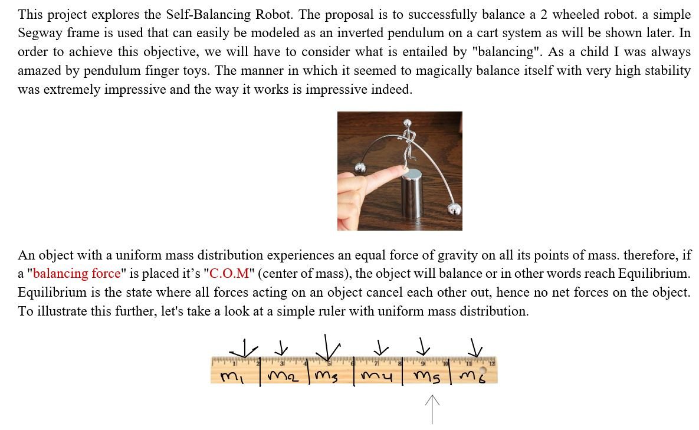  
   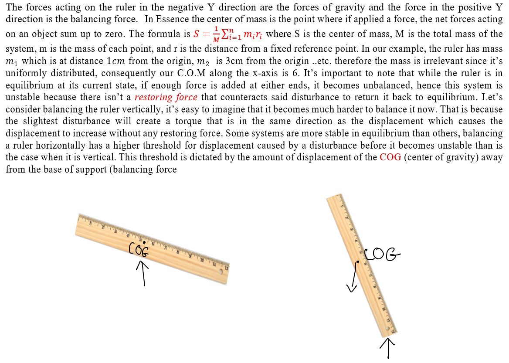   
   

##                                      KINEMATICS
   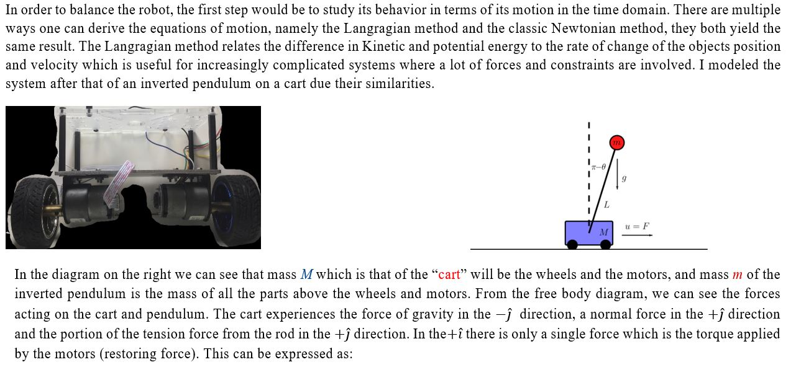
   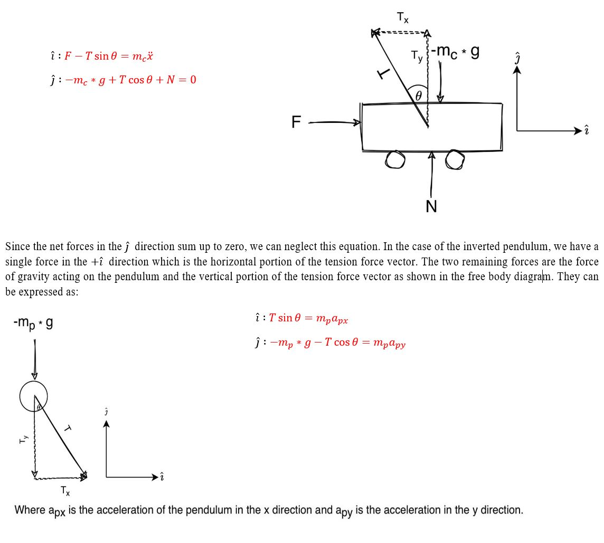
   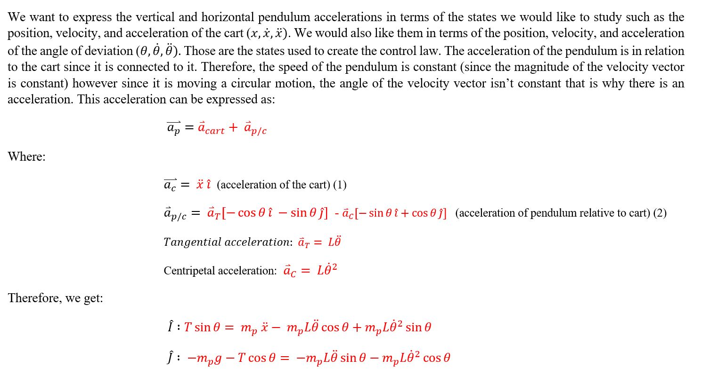
   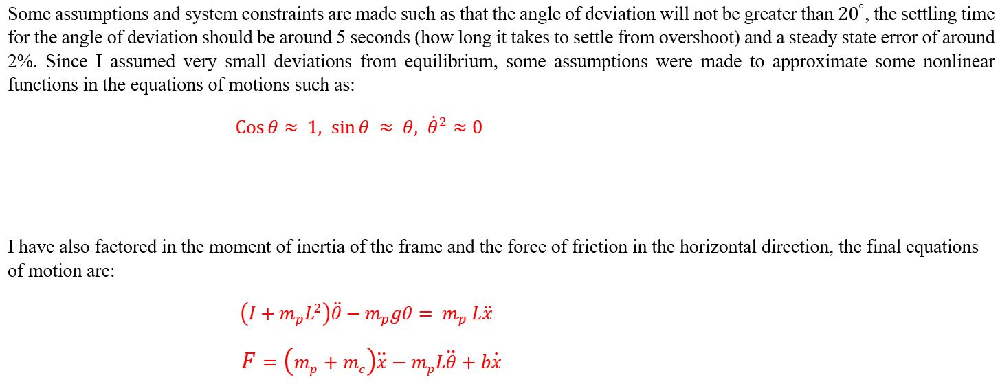
   

##                                    Linearization  
   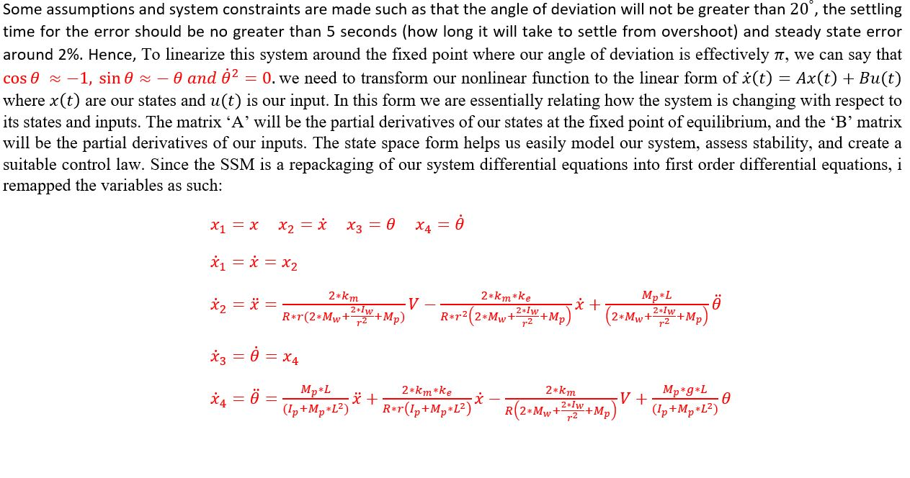
   

##                                    State Space Model
   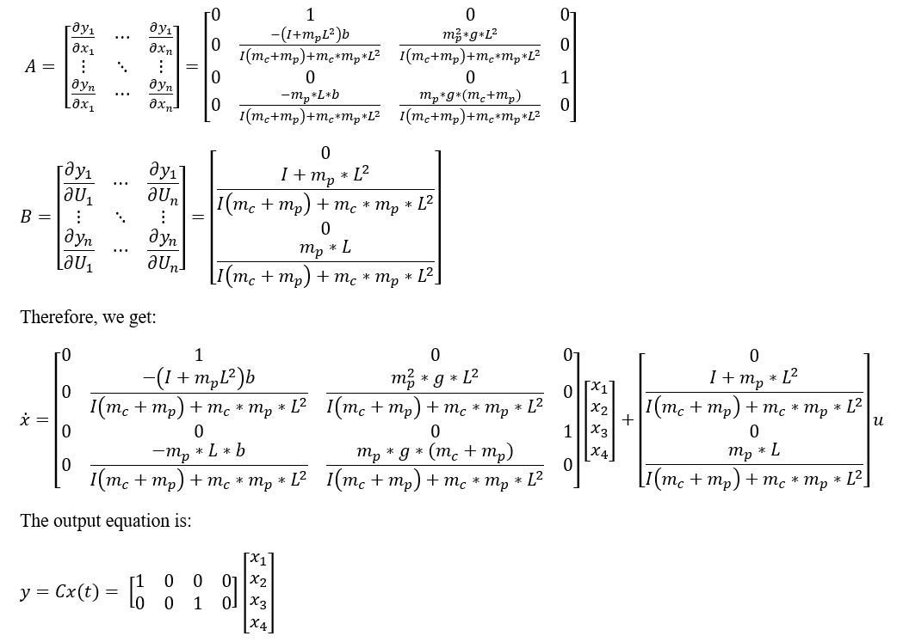
   
   

##                                     Laplace Transform
   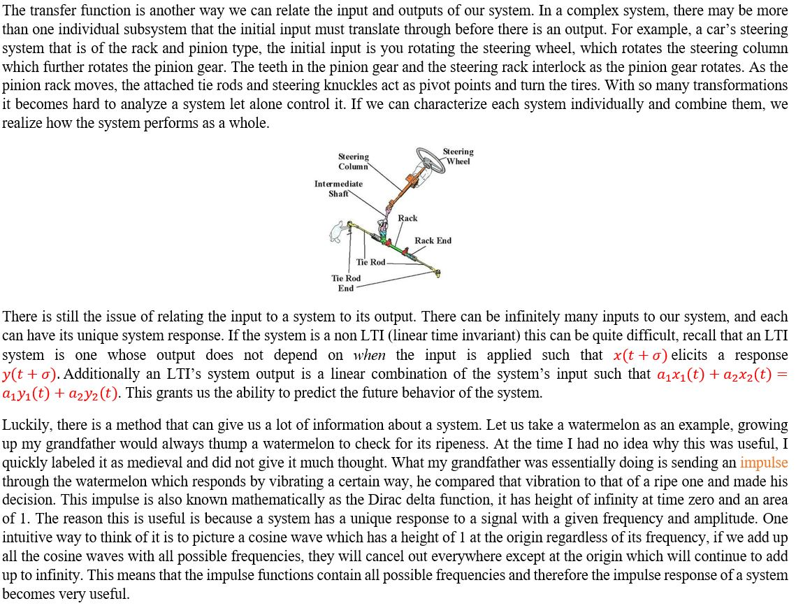
   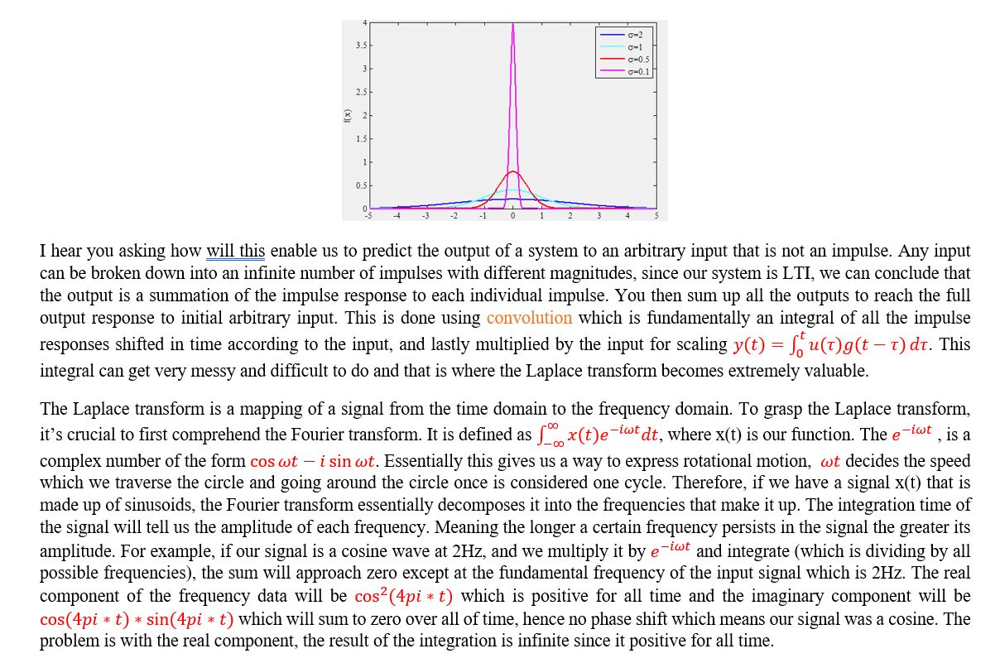
   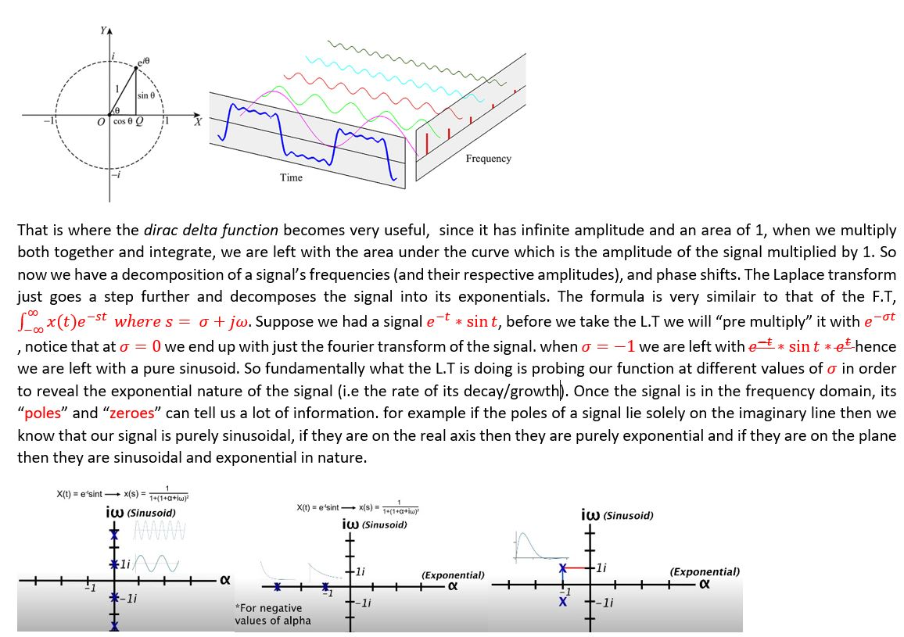
   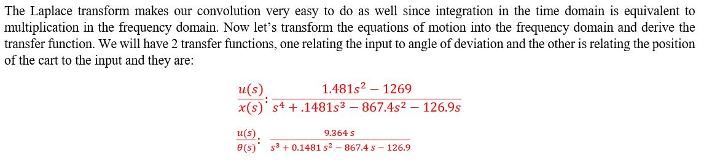

   

### 2. 
   
  
