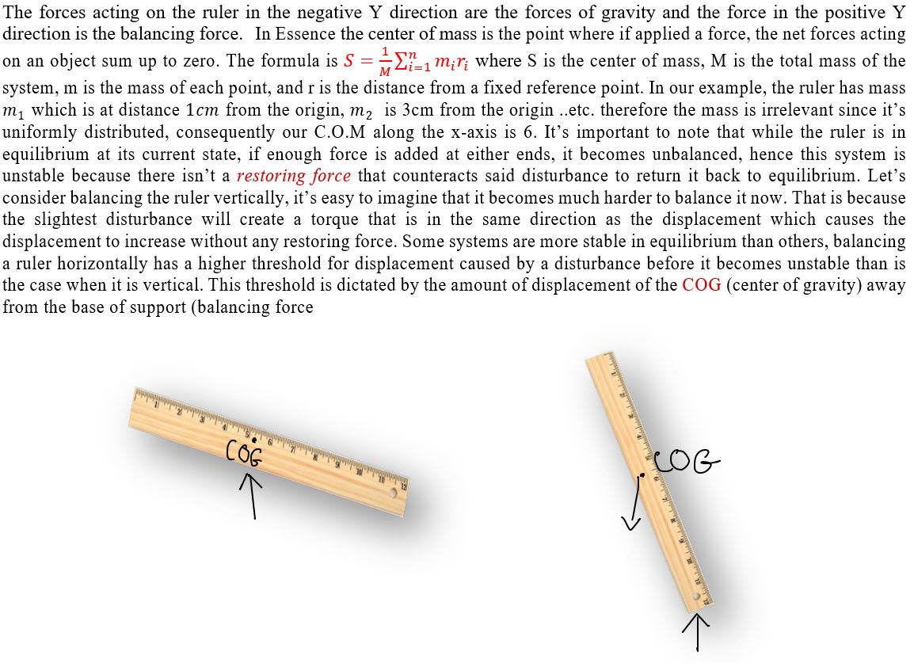

# Self_Balancing_Robot
This Project explores the theory behind the control of a 2 wheeled self balancing robot system. it includes the mathematical derivations, a feedback control system model in MATLAB SIMULINK and finally a real life application. 

## Table Of Contents

1. [ Theory & Model Derivation ](#desc)  
     1.1 [Introduction](#intro)  
     1.2 [Kinematics ](#kinematics)   
     1.3 [Linearization ](#Linearization)   
     1.4 [State Space Model](#SPM)  
     1.5 [Laplace Transform](#LT)   
     1.6 [Open Loop Stability analysis](#stability)   
     1.7 [FeedBack Controller Design](#pid)   
    
2. [ Application ](#App)  
     2.1 [Hardware](#HW) 
&nbsp;&nbsp;&nbsp;&nbsp;&nbsp;&nbsp;2.11 [Hardware Requirements](#HWREQS) 
&nbsp;&nbsp;&nbsp;&nbsp;&nbsp;&nbsp;2.12 [PCB Design](#HWREQS) 
     2.2 [Software](#SW)  
     2.3   
     2.4    
     2.5   
     

##                                     INTRODUCTION  
     
      
   

##                                      KINEMATICS
   
   
   
    
   
   
   
   

##                                    Linearization  
   
   

##                                    State Space Model
   
   
   

##                                     Laplace Transform
   
   
   
   

   

##                                    Open Loop Stability Analysis 
  
    
   
   
  

##                                    Feedback Controller
    
   

##                                   Hardware Requirements

This section discusses the hardware design for this project. Different components demand unique power requirements. In this step I listed all the different parts I used alongside their power needs.

|  Part      | Max Current (mA)   | Avg Current (mA)  | Voltage (V) | 
| :--------: | :----------------: | :---------------: | :---------: |
| Stm32F4    | 7                  | 5.7               | 3.3         |
| Mpu-6050   | 3.9                |                   | 3.3         |
| Motors     | 1200               | 170               | 12          |
| nrf24lo1   | 13.5               | 11.3              | 3.3         |

As shown in the table, the largest power consumer were the motors which require 12 volts and 1.2 amps of current. It is important to note that I needed to meet 3 different voltage levels, 12, 5 and 3.3, which meant I needed to implement a combination of step-down voltage regulators. One voltage regulator to step down the input voltage from 12V to 5V and another to step down from 5V to 3.3V. The power source requirements can also be inferred from the table. I wanted my robot to be powered on for about an hour, I also needed my battery to supply up to or more than 12V. The maximum current that could be drawn by the motors is 1.2A, however that is stall current (when the motors are stuck), so I relied on the average current consumption of 170mA. The average total current that will be consumed by my application is about 192mA and the maximum that would be draw in case the robot got stuck is 1422mA. There are multiple battery types that can be used, I first considered Li-Ion batteries however due to physical placement restrictions I decided to utilize a Li-Po battery. Li-Po batteries are robust, flexible, lightweight, and extremely low profile. They are characterized by their energy capacity measured in mAh, voltage, and discharge capacity. My battery of choice was an 1800mAh, 14.8V, 45C Li-Po, this means that the battery can output 1800mA for 1 hour at 14.8V, and the discharge capacity of 45C means that the maximum amount of current that can be drawn from the battery at any given time continuously is (45 x 1800) 81A.

There are two main ways you can step down a high voltage to a lower one, either by using a switching voltage regulator or a linear voltage regulator. A linear voltage regulator relies on resistive components to drive down the input voltage while a switching regulator uses a “switch” to transform the input voltage into a pulsed voltage, which is further filtered and smoothened out via a combination of capacitors and inductors. I decided to go with the NCP1117LPST50T3G which is a 5V low dropout voltage regulator and the AMS1117-3.3 which steps the 5V down to 3.3V. Linear regulators have fewer external parts and exhibit lesser noise than a switching regulator, nevertheless they are relatively less efficient. 

I also wanted to make use of the Stm32 USB interface which can be handy for data transfer between the PC and the microcontroller. Therefore i added a micro usb 2.0 to my design, this can also act as a 5V source. The challenge however is ensuring that we are only sourcing power from the battery when it is connected to the board instead of the USB. A simple circuit would consist of a Mosfet and an Op Amp. The Mosfet would be used as a switch and the op amp would be used as a comparator as shown in the schematic below:

The 5V from the USB is connected directly to the drain of the Mosfet, and the source of the Mosfet is connected to the input of the Ams1117. The Mosfet has to be turned ON for this voltage to appear at the input of the LDO. The battery input voltage is connected directly into the input of the NCP1117 LDO, which ouputs 5V as well. This 5V also appears at the input of the AMS1117 LDO. The gate of the Mosfet is connected to the output of the comparator. The comperator has two inputs, the input voltage from the battery at the non-inverting terminal and the +3v3 at the inverting terminal. The op amp is also connected to +5V at it's positive supply pin and GND at it's negative supply pin. If battery power is present, the voltage at the non-inverting terminal will be higher, which will cause the op amp to reflect the +5V at it's VCC pin at the output pin. This will will in turn turn off the PMOS which effectively blocks the +5V source from the USB. 

### I/O and Peripherals
I decided to use an Stm32F4 microcontroller more specifically the [STM32F401RCT6]([https://www.genome.gov/](https://www.st.com/en/microcontrollers-microprocessors/stm32f401rc.html)https://www.st.com/en/microcontrollers-microprocessors/stm32f401rc.html) for this project. This micrcontroller is based on an Arm Cortext M4 32-bit core that can operate at 84 MHz, which is much more processing power than we need. It also features an FPU which is usefull for the floating point arithmetic that is done in the firmware. With regards to memory, this MCU contains up to 256KB of flash memory and 64KB of SRAM. 
Peripherals and I/O are the way microcontrollers interact and communicate with the outside world. There are 81 General purpose Input/output pins on the STM32F401RCT6. All GPIOs are programmable and can be used as either input or output. Certain GPIO pins have alternate functions but not all. In my application I used an inertial measurement unit to acquire data from an accelerometer and gyroscope via I2C, a Motor driver to control the motors via Digital I/O, an rf transceiver for radio communication and an SWD connection for debugging and programming the microcontroller.  

In order to communicate with the MPU6050 I used I2C. It’s a synchronous serial communication protocol, it requires two wires, an SCL line (clock) and an SDA line (data). Both lines also require two pull up resistors as shown in the schematic below:

To communicate with the nRF24l01 (Transceiver) i used the SPI protocol. SPI requires 4 wires, MISO (Master in slave out), MOSI (Master out slave in), SCK (clock line), CS (chip select), EN (enable line) and an option interrupt line. SPI is also a synchronous communication protocl, meaning the data is synchronized to the rising or falling edge of a clock. 

