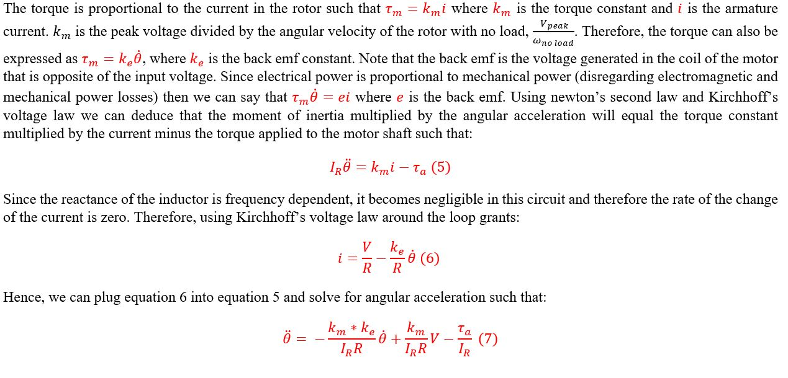
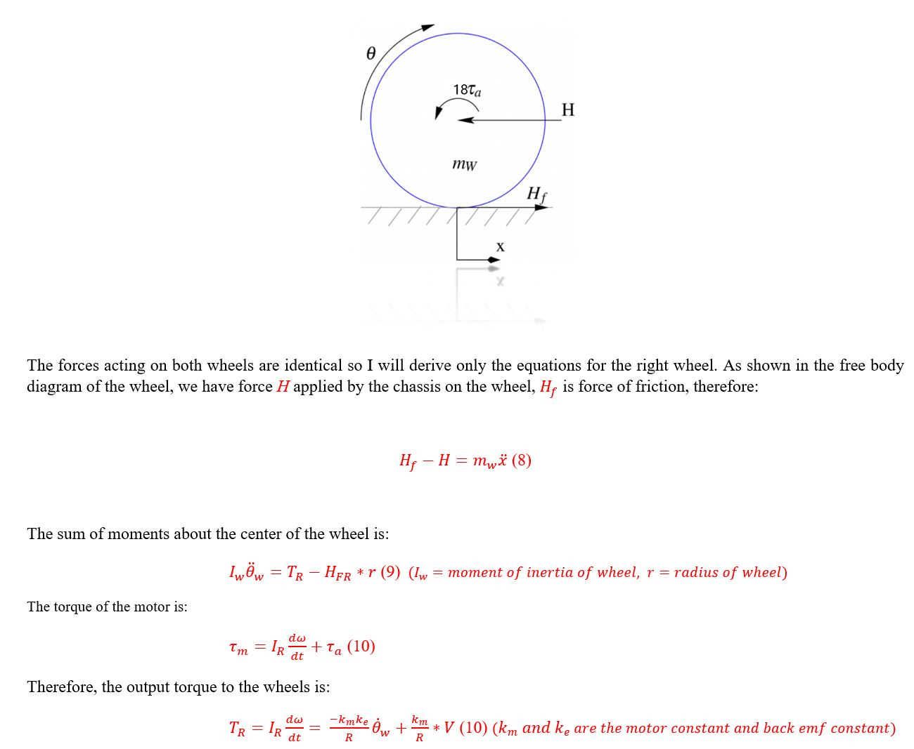

# Self_Balancing_Robot
This Project explores the theory behind the control of a 2 wheeled self balancing robot system. it includes the mathematical derivations, a feedback control system model in MATLAB SIMULINK and finally a real life application. 

## Table Of Contents

1. [ Theory & Model Derivation ](#desc)  
     1.1 [Introduction](#intro)  
     1.2 [Kinematics ](#kinematics)   
     1.3 [Linearization ](#Linearization)   
     1.4 [State Space Model](#SPM)  
     1.5 [Laplace Transform](#LT)   
     1.6 [Open Loop Stability analysis](#stability)   
     1.7 [FeedBack Controller Design](#pid)   
    
2. [ Application ](#App)  
     2.1 [Hardware](#HW) 
&nbsp;&nbsp;&nbsp;&nbsp;&nbsp;&nbsp;2.11 [Hardware Requirements](#HWREQS) 
&nbsp;&nbsp;&nbsp;&nbsp;&nbsp;&nbsp;2.12 [PCB Design](#HWREQS) 
     2.2 [Software](#SW)  
     2.3   
     2.4    
     2.5   
     

##                                     INTRODUCTION  
     
      
   

##                                      KINEMATICS
   
   
   
    
   
   
   
   

##                                    Linearization  
   
   

##                                    State Space Model
   
   
   

##                                     Laplace Transform
   
   
   
   

   

##                                    Open Loop Stability Analysis 
  
    
   
   
  

##                                    Feedback Controller
    
   

###                                   Hardware Requirements

This section discusses the hardware design for this project.  I decided to use an Stm32F4 microcontroller more specifically the [STM32F401RCT6]([https://www.genome.gov/](https://www.st.com/en/microcontrollers-microprocessors/stm32f401rc.html)https://www.st.com/en/microcontrollers-microprocessors/stm32f401rc.html). This micrcontroller is based on an Arm Cortext M4 32-bit core that can operate at 84 MHz, which is much more processing power than we need. It also features an FPU which is usefull for the floating point arithmetic that is done in the firmware. With regards to memory, this MCU contains up to 256KB of flash memory and 64KB of SRAM. 
  
 
